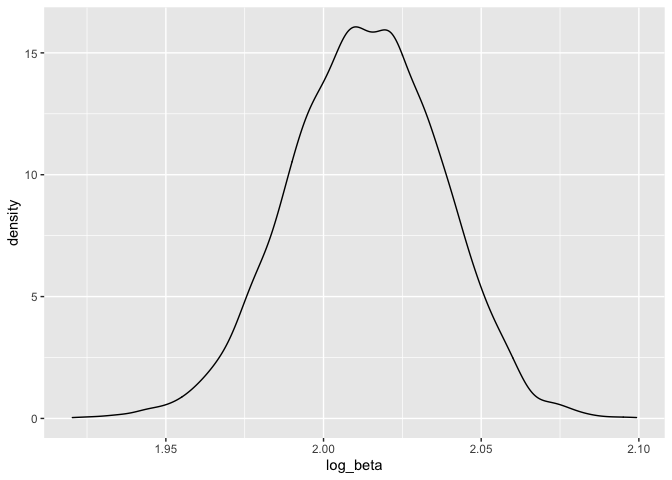

p8105\_hw6\_ml4424
================
Maggie Li (ml4424)
12/8/2020

# Problem 1

``` r
library(tidyverse)
```

    ## ── Attaching packages ────────────────────────────────────────────────────────────────────── tidyverse 1.3.0 ──

    ## ✓ ggplot2 3.3.2     ✓ purrr   0.3.4
    ## ✓ tibble  3.0.3     ✓ dplyr   1.0.2
    ## ✓ tidyr   1.1.2     ✓ stringr 1.4.0
    ## ✓ readr   1.4.0     ✓ forcats 0.5.0

    ## ── Conflicts ───────────────────────────────────────────────────────────────────────── tidyverse_conflicts() ──
    ## x dplyr::filter() masks stats::filter()
    ## x dplyr::lag()    masks stats::lag()

``` r
library(utils)
library(ggplot2)
library(modelr)

homicides_dta = read_csv("data/homicide-data.csv", na = c("", "NA", "Unknown")) %>% 
  mutate(city_state = str_c(city, state, sep = "_"),
         solved = case_when(disposition == "Closed by arrest" ~ 1,
                            disposition ==  "Closed without arrest" ~ 0,
                            disposition == "Open/No arrest" ~ 0),
         victim_age = as.numeric(victim_age),
         victim_race = as.factor(victim_race)) %>% 
  filter(city_state != "Tulsa_AL",
         city_state != "Dallas_TX", 
         city_state != "Phoenix_AZ", 
         city_state != "Kansas City_MO",
         victim_race %in% c("Black", "White")) %>% 
  select(city_state, solved, victim_age, victim_race, victim_sex)
```

    ## 
    ## ── Column specification ───────────────────────────────────────────────────────────────────────────────────────
    ## cols(
    ##   uid = col_character(),
    ##   reported_date = col_double(),
    ##   victim_last = col_character(),
    ##   victim_first = col_character(),
    ##   victim_race = col_character(),
    ##   victim_age = col_double(),
    ##   victim_sex = col_character(),
    ##   city = col_character(),
    ##   state = col_character(),
    ##   lat = col_double(),
    ##   lon = col_double(),
    ##   disposition = col_character()
    ## )

``` r
homicides_dta
```

    ## # A tibble: 39,693 x 5
    ##    city_state     solved victim_age victim_race victim_sex
    ##    <chr>           <dbl>      <dbl> <fct>       <chr>     
    ##  1 Albuquerque_NM      0         15 White       Female    
    ##  2 Albuquerque_NM      0         72 White       Female    
    ##  3 Albuquerque_NM      0         91 White       Female    
    ##  4 Albuquerque_NM      0         56 White       Male      
    ##  5 Albuquerque_NM      0         NA White       Male      
    ##  6 Albuquerque_NM      1         43 White       Female    
    ##  7 Albuquerque_NM      1         52 White       Male      
    ##  8 Albuquerque_NM      1         22 White       Female    
    ##  9 Albuquerque_NM      1         15 Black       Male      
    ## 10 Albuquerque_NM      1         25 Black       Male      
    ## # … with 39,683 more rows

``` r
# set race = white as referent

homicides_dta$victim_race <- relevel(homicides_dta$victim_race,
                                         ref = "White")
```

``` r
# baltimore df
baltimore_df =
  homicides_dta %>% 
  filter(city_state == "Baltimore_MD")
baltimore_df
```

    ## # A tibble: 2,753 x 5
    ##    city_state   solved victim_age victim_race victim_sex
    ##    <chr>         <dbl>      <dbl> <fct>       <chr>     
    ##  1 Baltimore_MD      0         17 Black       Male      
    ##  2 Baltimore_MD      0         26 Black       Male      
    ##  3 Baltimore_MD      0         21 Black       Male      
    ##  4 Baltimore_MD      1         61 White       Male      
    ##  5 Baltimore_MD      1         46 Black       Male      
    ##  6 Baltimore_MD      1         27 Black       Male      
    ##  7 Baltimore_MD      1         21 Black       Male      
    ##  8 Baltimore_MD      1         16 Black       Male      
    ##  9 Baltimore_MD      1         21 Black       Male      
    ## 10 Baltimore_MD      1         44 Black       Female    
    ## # … with 2,743 more rows

``` r
# run glm
baltimore_glm = baltimore_df %>% 
  glm(solved ~ victim_age + victim_sex + victim_race, 
      data = ., family = binomial()) 

baltimore_glm %>% 
  broom::tidy() %>% 
  mutate(OR = exp(estimate),
         lower_ci = exp(estimate - 1.96*std.error),
         upper_ci = exp(estimate + 1.96*std.error)) %>% 
  select(term, 
         log_OR = estimate, 
         OR, lower_ci, upper_ci)
```

    ## # A tibble: 4 x 5
    ##   term               log_OR    OR lower_ci upper_ci
    ##   <chr>               <dbl> <dbl>    <dbl>    <dbl>
    ## 1 (Intercept)       1.15    3.16     1.99     5.03 
    ## 2 victim_age       -0.00673 0.993    0.987    1.00 
    ## 3 victim_sexMale   -0.854   0.426    0.325    0.558
    ## 4 victim_raceBlack -0.842   0.431    0.306    0.607

``` r
models_results_df = homicides_dta %>% 
  nest(data = -city_state) %>% # nest by each city into a new data col
  mutate(
    models = 
      map(.x = data, 
          ~glm(solved ~ victim_age + victim_sex + victim_race, 
               data = .x, 
               family = binomial())), #run model as a column
    results = map(models, broom::tidy)) %>%  # results column
  select(city_state, results) %>% 
  unnest(results) %>%
  mutate(OR = exp(estimate),
         lower_ci = exp(estimate - 1.96*std.error),
         upper_ci = exp(estimate + 1.96*std.error)) %>%
  select(city_state,
         term,
         OR, lower_ci, upper_ci)

models_results_df
```

    ## # A tibble: 188 x 5
    ##    city_state     term                OR lower_ci upper_ci
    ##    <chr>          <chr>            <dbl>    <dbl>    <dbl>
    ##  1 Albuquerque_NM (Intercept)      2.79     1.05     7.36 
    ##  2 Albuquerque_NM victim_age       0.981    0.963    0.998
    ##  3 Albuquerque_NM victim_sexMale   1.77     0.831    3.76 
    ##  4 Albuquerque_NM victim_raceBlack 0.662    0.293    1.50 
    ##  5 Atlanta_GA     (Intercept)      3.12     1.53     6.36 
    ##  6 Atlanta_GA     victim_age       0.988    0.979    0.997
    ##  7 Atlanta_GA     victim_sexMale   1.00     0.684    1.46 
    ##  8 Atlanta_GA     victim_raceBlack 0.764    0.438    1.33 
    ##  9 Baltimore_MD   (Intercept)      3.16     1.99     5.03 
    ## 10 Baltimore_MD   victim_age       0.993    0.987    1.00 
    ## # … with 178 more rows

``` r
models_results_df %>% 
  filter(term == "victim_raceBlack") %>% # compare black to white victims
  mutate(city_state = fct_reorder(city_state, OR)) %>% 
  ggplot(aes(x = city_state, y = OR)) +
  geom_point() + 
  geom_errorbar(aes(ymin = lower_ci, ymax = upper_ci)) +
  theme(axis.text.x = element_text(angle = 90, hjust = 1))
```

<!-- -->
**Comments on plot**: For over half the states, there is a statistically
significant association between the victim being Black and the
likelihood of the homicide to go unsolved (i.e. closed without arrest or
remain open/no arrest) vs. the victim being white. For instance, the
odds that the homicide will remain unsolved for cases where the victim
is Black in Baltimore, MD is 0.43 times the odds that the homicide will
remain unsolved for cases where the victim is white.

# Problem 2

``` r
birthweight =
  read_csv("data/birthweight.csv") %>% 
  mutate(babysex = as.factor(babysex),
         frace = as.factor(frace),
         mrace = as.factor(mrace)) #convert numeric to factor for race
```

    ## 
    ## ── Column specification ───────────────────────────────────────────────────────────────────────────────────────
    ## cols(
    ##   .default = col_double()
    ## )
    ## ℹ Use `spec()` for the full column specifications.

``` r
sum(is.na(birthweight)) # no missing data 
```

    ## [1] 0

``` r
unique(birthweight$malform)
```

    ## [1] 0 1

``` r
# model for analysis
# selected based on underlying hypothesis, outcome = birthweight 

# use model fit statistic F-test to see if model is a good fit
our_model = birthweight %>% 
  lm(bwt ~ mrace + smoken + bhead + blength,
     data = .) # F-statistic = 1683
summary(our_model)
```

    ## 
    ## Call:
    ## lm(formula = bwt ~ mrace + smoken + bhead + blength, data = .)
    ## 
    ## Residuals:
    ##      Min       1Q   Median       3Q      Max 
    ## -1157.98  -184.77    -7.25   179.18  2488.13 
    ## 
    ## Coefficients:
    ##               Estimate Std. Error t value Pr(>|t|)    
    ## (Intercept) -5560.2985    97.7683 -56.872  < 2e-16 ***
    ## mrace2       -146.4016     9.4145 -15.551  < 2e-16 ***
    ## mrace3       -119.5611    43.3840  -2.756  0.00588 ** 
    ## mrace4       -142.3414    19.1594  -7.429 1.31e-13 ***
    ## smoken         -4.1110     0.6005  -6.846 8.64e-12 ***
    ## bhead         140.0642     3.4178  40.980  < 2e-16 ***
    ## blength        81.4459     2.0298  40.126  < 2e-16 ***
    ## ---
    ## Signif. codes:  0 '***' 0.001 '**' 0.01 '*' 0.05 '.' 0.1 ' ' 1
    ## 
    ## Residual standard error: 280.9 on 4335 degrees of freedom
    ## Multiple R-squared:  0.6996, Adjusted R-squared:  0.6992 
    ## F-statistic:  1683 on 6 and 4335 DF,  p-value: < 2.2e-16

``` r
birthweight %>% 
  modelr::add_residuals(our_model) %>% # add residuals to birthweight data
  modelr::add_predictions(our_model) %>% # add predictions to birthweight data
  ggplot(aes(x = pred, y = resid)) + geom_point()
```

<!-- -->

**Steps to building model:** I chose to use an underlying hypothesis to
drive my model building process. We know that exposure to certain
environmental conditions and social determinants impact birth outcomes
through stress responses, so I included smoking status and mother’s race
as predictor variables in the model. We also included baby head
circumference and length at birth since these are highly correlated with
birth weight.

**Comments on plot**: The lower predicted birthweight values seem to
skew positive in residual values. But there does not appear to be any
signs that the relationship between the predictor variables in the model
could have a non-linear relationship with birth weight.

``` r
set.seed(12345)

# split data into training and test data with 100 pairs
cv_df = crossv_mc(birthweight, 100) 

# compare CV results for all models
cv_df = 
  cv_df %>% 
  mutate(
    our_model = map(train, 
                    ~lm(bwt ~ gaweeks + momage + mrace + smoken + bhead + blength, 
                        data = .x)),
    main_effects_model  = map(train, 
                              ~lm(bwt ~ blength + gaweeks, data = .x)),
    threeway_interx_model  = map(train, 
                                 ~lm(bwt ~ bhead*blength*babysex, data = .))) %>% 
  mutate(
    rmse_our_model = map2_dbl(our_model, test, ~rmse(model = .x, data = .y)),
    rmse_main_effects = map2_dbl(main_effects_model, test, ~rmse(model = .x, data = .y)),
    rmse_interx = map2_dbl(threeway_interx_model, test, ~rmse(model = .x, data = .y)))
cv_df
```

    ## # A tibble: 100 x 9
    ##    train test  .id   our_model main_effects_mo… threeway_interx… rmse_our_model
    ##    <lis> <lis> <chr> <list>    <list>           <list>                    <dbl>
    ##  1 <res… <res… 001   <lm>      <lm>             <lm>                       291.
    ##  2 <res… <res… 002   <lm>      <lm>             <lm>                       281.
    ##  3 <res… <res… 003   <lm>      <lm>             <lm>                       274.
    ##  4 <res… <res… 004   <lm>      <lm>             <lm>                       273.
    ##  5 <res… <res… 005   <lm>      <lm>             <lm>                       273.
    ##  6 <res… <res… 006   <lm>      <lm>             <lm>                       280.
    ##  7 <res… <res… 007   <lm>      <lm>             <lm>                       278.
    ##  8 <res… <res… 008   <lm>      <lm>             <lm>                       280.
    ##  9 <res… <res… 009   <lm>      <lm>             <lm>                       283.
    ## 10 <res… <res… 010   <lm>      <lm>             <lm>                       293.
    ## # … with 90 more rows, and 2 more variables: rmse_main_effects <dbl>,
    ## #   rmse_interx <dbl>

``` r
cv_df %>% 
  select(starts_with("rmse")) %>% 
  pivot_longer(
    everything(),
    names_to = "model", 
    values_to = "rmse",
    names_prefix = "rmse_") %>% 
  mutate(model = fct_inorder(model)) %>% 
  ggplot(aes(x = model, y = rmse)) + geom_violin()
```

<!-- -->

**Comparing our model with the two others**: The distribution of the
RMSE for our model appears to be better (i.e. lower on average over 100
different iterations of training and test data) than the main effects
only and three-way interaction models specified in the assignment.

# Problem 3

``` r
weather_df = 
  rnoaa::meteo_pull_monitors(
    c("USW00094728"),
    var = c("PRCP", "TMIN", "TMAX"), 
    date_min = "2017-01-01",
    date_max = "2017-12-31") %>%
  mutate(
    name = recode(id, USW00094728 = "CentralPark_NY"),
    tmin = tmin / 10,
    tmax = tmax / 10) %>%
  select(name, id, everything())
```

    ## Registered S3 method overwritten by 'hoardr':
    ##   method           from
    ##   print.cache_info httr

    ## using cached file: /Users/maggieli/Library/Caches/R/noaa_ghcnd/USW00094728.dly

    ## date created (size, mb): 2020-12-09 21:06:37 (7.536)

    ## file min/max dates: 1869-01-01 / 2020-12-31

``` r
weather_df
```

    ## # A tibble: 365 x 6
    ##    name           id          date        prcp  tmax  tmin
    ##    <chr>          <chr>       <date>     <dbl> <dbl> <dbl>
    ##  1 CentralPark_NY USW00094728 2017-01-01     0   8.9   4.4
    ##  2 CentralPark_NY USW00094728 2017-01-02    53   5     2.8
    ##  3 CentralPark_NY USW00094728 2017-01-03   147   6.1   3.9
    ##  4 CentralPark_NY USW00094728 2017-01-04     0  11.1   1.1
    ##  5 CentralPark_NY USW00094728 2017-01-05     0   1.1  -2.7
    ##  6 CentralPark_NY USW00094728 2017-01-06    13   0.6  -3.8
    ##  7 CentralPark_NY USW00094728 2017-01-07    81  -3.2  -6.6
    ##  8 CentralPark_NY USW00094728 2017-01-08     0  -3.8  -8.8
    ##  9 CentralPark_NY USW00094728 2017-01-09     0  -4.9  -9.9
    ## 10 CentralPark_NY USW00094728 2017-01-10     0   7.8  -6  
    ## # … with 355 more rows

``` r
# bootstrap 5000 times

bootstrap_results = weather_df %>% 
  modelr::bootstrap(n = 5000) %>% # bootstrap from og data 
  mutate(
    models = map(strap, ~ lm(tmax ~ tmin, data = .x)),
    coef_results = map(models, broom::tidy),
    r2 = map(models, broom::glance)) %>%
  select(.id, coef_results, r2) %>% 
  unnest(coef_results, r2) 
```

    ## Warning: unnest() has a new interface. See ?unnest for details.
    ## Try `df %>% unnest(c(coef_results, r2))`, with `mutate()` if needed

``` r
# get log summed betas for all bootstrapped data
r2_logbeta_vals = bootstrap_results %>% 
  select(.id, term, estimate, r.squared) %>% # get rid of all the other cols
  pivot_wider(names_from = term,
              values_from = estimate) %>% 
  mutate(log_beta = log(tmin * `(Intercept)`)) # pivot wider to get separate columns for intercept and tmin beta


# plot
r2_logbeta_vals %>% ggplot(aes(x = log_beta)) + geom_density()
```

<!-- -->

``` r
r2_logbeta_vals %>% ggplot(aes(x = r.squared)) + geom_density()
```

<!-- -->

**Comments**: The distribution of the log of the product of the
intercept and tmin parameter estimate peaks at around 2.02 and is
roughly normally distributed. The distribution of the r squared values
peaks at around 0.912 and is roughly normally distributed.

``` r
# get 95% ci for both parameters
r2_logbeta_vals %>% 
  select(-.id) %>% 
  summarize(ci_lower_r2 = quantile(r.squared, 0.025), 
            ci_upper_r2 = quantile(r.squared, 0.975),
            ci_lower_betas = quantile(log_beta, 0.025),
            ci_upper_betas = quantile(log_beta, 0.975))
```

    ## # A tibble: 1 x 4
    ##   ci_lower_r2 ci_upper_r2 ci_lower_betas ci_upper_betas
    ##         <dbl>       <dbl>          <dbl>          <dbl>
    ## 1       0.893       0.927           1.97           2.06

**Comments**: The 95% confidence interval for the r-squared value is
(0.893, 0.927) and for the log of the product of the betas is (1.966,
2.059).
